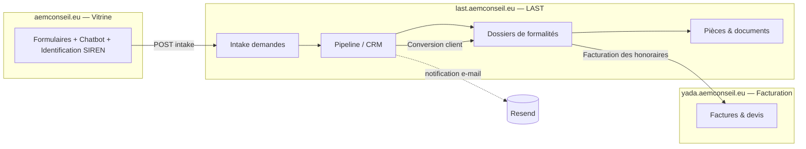

# Fiche technique — **LAST** (`last.aemconseil.eu`)

> Plateforme de **formalités** et de **traitement des demandes** de l'écosystème AEM-CONSEIL.
> Document de cadrage technique — version 1 · août 2026.

---

## 1. Positionnement

LAST est le **troisième pilier** de l'écosystème AEM-CONSEIL. Il centralise deux
fonctions aujourd'hui absentes ou dispersées :

1. **Traitement des demandes** — recevoir, qualifier, attribuer et suivre toutes
   les demandes générées par le site vitrine `aemconseil.eu` (contact, rappel,
   rendez-vous, newsletter, kit, chatbot, identification SIREN).
2. **Formalités** — piloter les dossiers de formalités juridiques et
   administratives du cabinet (création, modifications, cessation, dépôt des
   comptes…), de la demande initiale jusqu'au dépôt au guichet unique.

| Site | Rôle | Public |
|---|---|---|
| **aemconseil.eu** | Vitrine, ressources, génération de demandes | Prospects / clients |
| **yada.aemconseil.eu** | Production des factures & devis, e-facturation, abonnements | Clients |
| **last.aemconseil.eu** | **Formalités + traitement des demandes (back-office)** | Cabinet (+ portail client suivi de dossier) |

---

## 2. Constat de départ (l'existant)

Aujourd'hui, sur `aemconseil.eu`, **toutes** les demandes sont envoyées par
**FormSubmit.co** en e-mail vers `aemconseil.sas@gmail.com` :

| Source | Formulaire | Traitement actuel |
|---|---|---|
| Contact | `#contactForm` | e-mail FormSubmit |
| Être rappelé | `#callbackForm` | e-mail FormSubmit |
| Prise de rendez-vous | `#rdvForm` | e-mail FormSubmit |
| Newsletter | `#newsForm` | e-mail FormSubmit |
| Kit / ressource | `#kitFormEl` | e-mail FormSubmit |
| Chatbot (« être recontacté ») | `assets/chat.js` (`@lead`) | local / endpoint optionnel |
| Identification SIREN | `/identification/` | redirection vers yada |

**Limites** : pas de base de données, pas de statut/attribution, pas d'historique,
risque de perte dans la boîte mail, aucun reporting. **LAST remplace ce point de
fuite par une intake structurée**, tout en conservant une notification e-mail.

---

## 3. Vue d'ensemble



---

## 4. Périmètre fonctionnel

### 4.A — Traitement des demandes (back-office)

- **Intake unifiée** : toutes les demandes du site arrivent dans une table unique
  `demandes`, quel que soit le canal (source horodatée + typée).
- **Boîte de réception** : liste filtrable (source, statut, date, responsable).
- **Qualification** : passage d'un statut à l'autre
  `nouveau → qualifié → en cours → converti / perdu / clos`.
- **Attribution** : affectation à un membre du cabinet, priorité, échéance.
- **Conversion** : transformer une demande en **client** (et, si besoin, ouvrir un
  **dossier de formalité**).
- **Notifications** : e-mail transactionnel (Resend) au cabinet à chaque nouvelle
  demande, + accusé de réception au demandeur (optionnel).
- **Vue Kanban** (option) pour piloter le flux d'un coup d'œil.

### 4.B — Formalités

- **Types de dossiers** couverts :
  - **Création** : SASU, SAS, SARL, EURL, EI, micro-entreprise, SCI…
  - **Modifications** : transfert de siège, changement de dirigeant, augmentation /
    réduction de capital, changement d'objet ou de dénomination.
  - **Cessation** : dissolution, liquidation, radiation.
  - **Comptes annuels** : approbation (PV d'AG) et dépôt.
- **Cycle de vie du dossier** :
  `à faire → pièces attendues → en cours → déposé (guichet unique INPI) → en attente greffe → clos`.
- **Checklist par type** : liste des pièces obligatoires pré-remplie selon la
  formalité choisie.
- **Gestion des pièces** : dépôt de fichiers (stockage privé), statut par pièce
  (attendue / reçue / validée / rejetée).
- **Génération de documents** (phase ultérieure) : statuts, PV d'AG, attestations,
  projets d'annonce légale — à partir des données du dossier.
- **Suivi guichet unique INPI** : référence de dépôt, échéances, relances.
- **Portail client** (option) : le client suit l'avancement de son dossier et
  dépose ses pièces en ligne.

---

## 5. Architecture technique

Même socle que le reste de l'écosystème, pour la cohérence et la réutilisation.

| Couche | Choix | Réutilisation |
|---|---|---|
| **Front** | HTML/CSS/JS statique, **GitHub Pages** + `CNAME last.aemconseil.eu` | Même approche que aemconseil.eu / yada |
| **Design** | Système de tokens « Spatial UI » sombre, polices auto-hébergées | `assets/fonts.css`, `assets/article.css` |
| **Auth** | **Supabase Auth** — accès réservé au cabinet (rôles) | Même que yada |
| **Base** | **Supabase Postgres** + **RLS** | Projet dédié *ou* partagé (voir §10) |
| **Stockage** | **Supabase Storage** (buckets privés) pour les pièces | — |
| **Serveur** | **Supabase Edge Functions** (intake, notifications, génération docs) | — |
| **E-mail** | **Resend** (transactionnel) | `RESEND-SETUP.md` (yada) |
| **PWA** | Service worker + manifeste (option) | Modèle yada / aemconseil |
| **SIREN** | Composant `siren-autofill` (API `recherche-entreprises.api.gouv.fr`) | Déjà écrit (`components/siren-autofill/`) |

---

## 6. Modèle de données (Supabase)

```
demandes            id · source · type · nom · prenom · email · telephone
                    · siren · entreprise · objet · message · statut · priorite
                    · assigned_to · client_id · created_at · updated_at · meta(jsonb)

clients             id · type(societe|particulier) · siren · siret · raison_sociale
                    · nom · prenom · adresse · cp · ville · email · telephone
                    · tva · forme_juridique · source_demande_id · created_at

dossiers_formalites id · client_id · type_formalite · sous_type · statut
                    · reference_inpi · echeance · honoraires · facture_yada_id
                    · assigned_to · notes · created_at · updated_at

pieces              id · dossier_id · nom · type · storage_path
                    · statut(attendue|recue|validee|rejetee) · uploaded_by · created_at

taches              id · dossier_id? · demande_id? · libelle · statut
                    · echeance · assigned_to

profils (staff)     id(auth) · nom · role(admin|gestionnaire|lecture)

activity_log        id · entite · entite_id · action · acteur · payload(jsonb) · at
```

Toutes les tables sont protégées par **RLS** ; l'accès est limité aux utilisateurs
authentifiés du cabinet (le portail client, en option, ne voit que ses propres
dossiers via une politique dédiée).

---

## 7. Flux d'intégration

### 7.1 Alimentation depuis aemconseil.eu
- Une **Edge Function `intake`** expose un endpoint POST. Les formulaires du site
  (aujourd'hui FormSubmit) y envoient leur charge utile → insertion dans `demandes`
  + notification e-mail via Resend.
- **Deux stratégies possibles** (voir §10) :
  - **Bascule** : remplacer l'URL FormSubmit par l'endpoint LAST.
  - **Transition** : double envoi (e-mail FormSubmit **et** base LAST) le temps de
    valider, puis bascule complète.
- Le **honeypot** anti-spam existant est conservé ; l'endpoint ajoute une validation
  serveur + horodatage.

### 7.2 Lien avec l'identification SIREN
- La page `/identification/` peut, avant de rediriger vers yada, **créer/retrouver
  un client** dans LAST (source = `identification`) — la société est ainsi connue
  du back-office dès le premier contact.

### 7.3 Lien avec yada (facturation)
- Identité client partagée par **SIREN**. Quand une formalité est facturable, LAST
  ouvre la facturation sur yada via le **deep-link pré-rempli** déjà en place
  (`…/?type=…&raison=…&siret=…#facturation`) et stocke la référence de facture.

---

## 8. Sécurité & conformité

- **RLS** systématique + rôles cabinet (admin / gestionnaire / lecture).
- **RGPD** : les demandes sont des données personnelles. Durées de conservation
  alignées sur la politique de confidentialité du site (prospection ≤ 3 ans ;
  pièces liées à une mission selon les délais légaux). Droit d'accès / effacement
  outillé côté back-office.
- **Stockage privé** des pièces (aucune URL publique ; accès signé et temporaire).
- **Hébergement** : privilégier la **région UE** du projet Supabase.
- **Journalisation** (`activity_log`) de toutes les actions sensibles.

---

## 9. Feuille de route

| Phase | Contenu | Livrable |
|---|---|---|
| **P0 — Fondations** | Dépôt `last-aemconseil`, `CNAME`, GitHub Pages, projet Supabase, Auth, import du design system | Coquille connectée + connexion cabinet |
| **P1 — Intake** | Table `demandes` + Edge Function `intake` + branchement des formulaires aemconseil.eu + notif Resend + boîte de réception | Les demandes atterrissent en base, plus dans un e-mail |
| **P2 — Pipeline** | Statuts, attribution, priorités, Kanban, conversion en client | CRM léger opérationnel |
| **P3 — Formalités** | Dossiers, checklists par type, pièces (Storage), suivi guichet unique | Gestion complète des dossiers |
| **P4 — Intégrations** | Lien yada (honoraires), génération de documents, tableau de bord, portail client | Écosystème bouclé |

---

## 10. Hypothèses & décisions à valider

1. **Nom « LAST »** — acronyme (ex. *Legal & Administrative Services Terminal* ?)
   ou nom de marque ? Impacte le libellé de l'interface.
2. **Projet Supabase** — **dédié** (cloisonnement net des données du back-office)
   ou **partagé** avec yada ? Recommandation : **dédié**.
3. **Migration des formulaires** — bascule directe FormSubmit → LAST, ou phase de
   **double envoi** en transition ? Recommandation : double envoi puis bascule.
4. **Génération de documents** (statuts, PV) — souhaitée dès P3, ou suivi manuel
   d'abord puis automatisation ?
5. **Portail client** (suivi de dossier + dépôt de pièces en ligne) — dans le
   périmètre, ou back-office interne d'abord ?
6. **Périmètre des formalités** de départ — tout, ou d'abord la **création
   d'entreprise** (le plus fréquent) puis extension ?

---

*Prochaine étape possible : je scaffolde le dépôt `last-aemconseil` (P0 + P1) —
coquille sur le design AEM, connexion cabinet, table `demandes` et branchement des
formulaires du site — dès que les décisions du §10 sont tranchées.*
